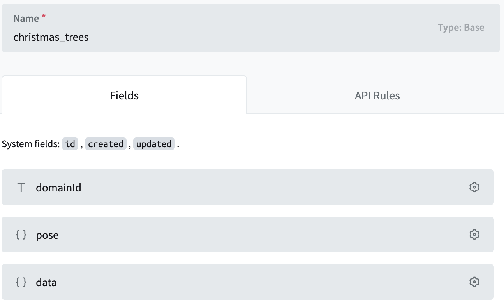

# Project overview

This project, created together with the (TUMO center)[https://tumo.org/] students during a 2-week workshop, demonstrates some of the basic features of a posemesh domain. It allows users to place AR Christmas trees in a persistent position in the physical space and decorate them with friends and family. It demonstrates how to place virtual assets, interact with them, save and load data to a custom backend, and test the AR setup in a simulated environment in Unity Editor.

## Packages and tools

- [Auki Labs ConjureKit(v0.6.44), ARFoundation Integration(v0.6.35), and Manna (v0.6.58)](https://conjurekit.dev) are used to interact with the pose mesh protocol and provide persistent positioning in AR.

- [XRSimulationEnvironments](https://docs.unity3d.com/Packages/com.unity.xr.arfoundation@5.1/manual/xr-simulation/simulation-overview.html) is used to quickly test the AR features in a simulated environment in Unity Editor.

- [XR Interaction Toolkit](https://docs.unity3d.com/Packages/com.unity.xr.interaction.toolkit@2.5/manual/index.html) for placing and manipulating assets in AR as well as example assets and scripts from the package samples.

- [GLTF Utility](https://github.com/siccity/gltfutility.git) for importing some .glb and .gltf 3D models. Some of the students used the [Luma AI](https://lumalabs.ai/) app to scan real-world objects and display them in AR.

- [PocketBase](https://pocketbase.io/) is used to store the Christmas tree data in a persistent database.

## Setup

### Posemesh Domain

Follow the instructions on the ConjureKit documentation website (link TBA) to create an account on the posemesh console, set up a domain, and download the posemesh QR code.
Import the downloaded QR code to the **Assets/QR** folder and assign it as the **Base Map** on the **Auki_QRCode** material located in the same folder. You should now see your QR code on the floor of the [Museum simulation environment](./Assets/UnityXRContent/ARFoundation/SimulationEnvironments/Museum/Museum_69ftx48ft) prefab, named **Auki QR**. Make sure that the game object scale matches the physical size you used when generating the QR code on the posemesh console (e.g., 0.05 in Unity is 5cm in the real world).

### PocketBase

Check the PocketBase documentation to download and run the database engine.
Copy the API URL to the **PocketbaseApiClient.cs** **_apiUrl** field. Your localhost URL (e.g., http://127.0.0.1:8090/api) should be enough for testing in the editor, but if you want to run the app on mobile you'll either need to run PocketBase in cloud or use tools like [ngrok](https://ngrok.com/use-cases/ingress-for-dev-test-environments) to make your local PocketBase server accessible over the internet.

On the PocketBase admin website, go to Settings -> Import Collections and import this [pb_schema.json](./ReadmeAssets/pb_schema.json) to configure the database with the *christmas_trees* collection.



Then, from the collection settings page, go to the **API Rules** tabs and unlock all rules.

## Scenes and classes

### Domain Editor Scene

This scene is used for placing trees inside a domain. It uses some of the UI elements and classes from XR Interaction Toolkit samples to place, delete, and move the 3D objects in the space.

`DomainTreeSpawner.cs` handles the creation, reading, updating, and deleting operations and communication to the PocketBase backend through `PocketbaseApiClient.cs`. Users can click the prefab button, select the prefab from the menu, and tap on the screen to do a ray cast from that point to a horizontal plane and instantiate the asset in the ray cast hit point. You can then hold and drag the asset along the horizontal plane.

`ConjureKitWrapper.cs` initializes the ConjureKit SDK and handles the calibration process, which will automatically modify your Unity coordinate space to match the information stored in the domain. Once calibrated, any previously stored position and rotation information will match the same physical location. Without it, the coordinates will change every time you start the app based on the location of the device, and persistence will be impossible.

Build and run the `DomainEditorScene` to scan into a domain, place the trees, and save their Pose to PocketBase.


### ChristmasScene Scene

This scene loads the existing trees in the domain and allows the user to decorate using various available ornaments.

`OrnamentSpawner.cs` handles selecting and previewing the ornament and material from the menu, performs a ray cast from the center of the screen to select a valid `OrnamentPosition` on the tree and place or remove an `Ornament`.

The `DomainTreeSpawner.cs` loads and spawns the existing trees in the domain and updates the tree data on the PocketBase through `PocketbaseApiClient.cs` when the user adds or removes an ornament from it.


### Data classes and saving/loading from the backend

The classes in [Scripts/Posemesh/Pocketbase/Model](Assets/Scripts/Posemesh/Pocketbase/Model) folder are used to serialize and deserialize the Christmas tree and ornament data to JSON used when communicating with PocketBase.

`GetTreesResponse.cs` and `ChristmasTreeData.cs` classes are used by `PocketbaseApiClient.cs` for sending and receiving data to PocketBase. `OrnamentData.cs` and `TreeData.cs` represent the data of a Christmas tree, and the `SerializablePose.cs` is for storing the position and rotation of the tree in a domain.

### QR detection simulation

The [FrameFeederEditor.cs](Assets/Scripts/Posemesh/FrameFeederEditor.cs) is used to enable the Manna QR detection in the simulation environments in Unity Editor.
The `ConjureKitWrapper.cs` will use this class or the `FrameFeederGPU.cs` from the ARFoundationExtensions package, depending on the platform.

```csharp
#if UNITY_EDITOR
        arCamera.gameObject.AddComponent<FrameFeederEditor>().AttachMannaInstance(_manna);
#else
        _manna.GetOrCreateFrameFeederComponent().AttachMannaInstance(_manna);
#endif
```

### UI classes and visual effects

The UI classes in [Scripts/UI](Assets/Scripts/UI) folder handle the basic UI button and menu interactions. 

The `Confetti.cs` is used when placing a new ornament and `ContinuousMaterialChanger.cs` on the lights on the house and serves only a visual purpose.