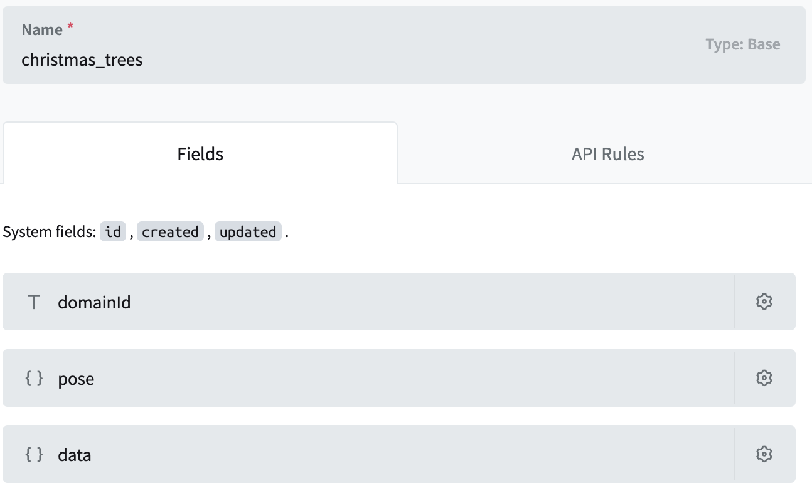
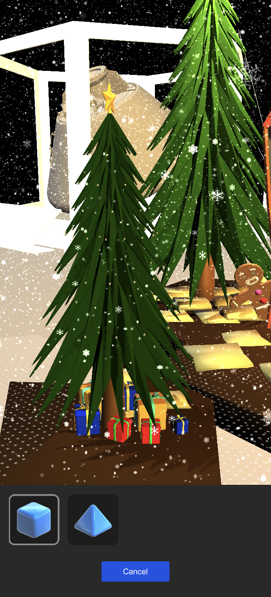

# Project overview

This project was created during a 2-week workshop at (TUMO center)[https://tumo.org/] to create a simple AR christmas tree that can be placed in a domain and decorated with friends and family. Here's the quick overview of the project and the components used.

## Packages and tools

- [Auki Labs ConjureKit(v0.6.44) and ARFoundation Integration(v0.6.35)](https://conjurekit.dev)

- [XRSimulationEnvironments](https://docs.unity3d.com/Packages/com.unity.xr.arfoundation@5.1/manual/xr-simulation/simulation-overview.html) is used to quickly test the AR features in a simulated environment in Unity Editor.

- [GLTF Utility](https://github.com/siccity/gltfutility.git) for importing some .glb and .gltf 3D models.

- [PocketBase](https://pocketbase.io/) to store the Christmas tree data in a persistant database.
Check the PocketBase documentation to download and run the database engine.
Copy the API url to the **Pocketbase Client**'s **Api Url** field in the scene hierarchy.

Create a new collection "christmas_trees" with the following fields:

**domainId**: PlainText

**pose**: JSON

**data**: JSON



Go to the **API Rules** tabs and unlock everything.

## Scenes and main classes

### Domain Editor Scene

This scene is used for placing trees inside a domain. It uses some of the UI elements and classes from XR Interaction Toolkit samples to place, delete, and move the 3D objects in the space. `DomainTreeSpawner.cs` handles the CRUD operations and communication to the PocketBase backend through `PocketbaseApiClient.cs`. User can click the prefab button, select the prefab from the menu and tap on the screen to do a raycast from that point to a horizontal plane and instantiate the asset in the raycast hit point.



### ChristmasScene Scene

This scene loads the existing trees in the domain and allows the user to decorate using various available ornaments.

### OrnamentSpawner.cs

The scene hierarchy has a **OrnamentSpawner** game object with the `OrnamentSpawner.cs` class attached to it. It stores the list of all the available ornaments and materials for them.

```csharp
public class OrnamentSpawner : MonoBehaviour { 
 
    [SerializeField] private Camera mainCamera;
    [SerializeField] private Transform environment;
    [SerializeField] private List<Ornament> ornamentPrefabs;
    [SerializeField] private List<Material> ornamentMaterials;
    [SerializeField] private OrnamentButton ornamentButtonPrefab;
    [SerializeField] private ColorButton colorButtonPrefab;
    [SerializeField] private Transform ornamentButtonContent;
    [SerializeField] private Transform colorButtonContent;

```
On `Start` it creates buttons for each ornament type and material and on `Update` does a raycast from the screen center.
If the raycast hit a valid `OrnamentPosition` on the tree the current ornament will be placed there.

### ChristmasTree.cs

The `ChristmasTree.cs` class on the `Environment/House with trees` game object is responsible for configuring the positions where an ornament can be placed.
This class has the list of all the ornament positions and initializes them on `Start`. If there is information about previously placed ornaments in the `PlayerPrefs`
it will be passed to the position to recreate the ornament.

```csharp
public class ChristmasTree : MonoBehaviour
{
    [SerializeField] private ConjureKitWrapper conjureKitWrapper;
    [SerializeField] private List<Transform> ornamentPositions = new List<Transform>();

    private void Start()
    {
        for (var i = 0; i < ornamentPositions.Count; i++)
        {
            var ornamentPositionTransform = ornamentPositions[i];
            OrnamentPosition ornamentPosition = ornamentPositionTransform.gameObject.AddComponent<OrnamentPosition>();
            ornamentPosition.Initialize(i, conjureKitWrapper.OrnamentSystem);

            if (PlayerPrefs.HasKey(ornamentPosition.name))
            {
                string json = PlayerPrefs.GetString(ornamentPosition.name);
                OrnamentData ornamentData = JsonUtility.FromJson<OrnamentData>(json);
                ornamentPosition.AttachedOrnamentData = ornamentData;
            }
        }
    }
}
```

### OrnamentPosition.cs

This class represents the places where the ornaments can be hung from. When new `OrnamentData` is passed to the position
a new `Ornament` will be instantiated and the information will be saved in `PlayerPrefs`.

```csharp
public OrnamentData AttachedOrnamentData
{
    get
    {
        return _attachedOrnamentData;
    }
    set
    {
        RemoveOrnament();
        
        _attachedOrnamentData = value;
        _attachedOrnamentData.positionIndex = _positionIndex;
        Ornament ornamentPrefab = Resources.Load<Ornament>("Ornaments/" + _attachedOrnamentData.prefab);
        _attachedOrnament = Instantiate(ornamentPrefab, this.transform);
        _attachedOrnament.SetMaterial(Resources.Load<Material>("Materials/" + _attachedOrnamentData.material));
        _attachedOrnament.text = _attachedOrnamentData.text;

        string json = JsonUtility.ToJson(_attachedOrnamentData);
        PlayerPrefs.SetString(gameObject.name, json);
        PlayerPrefs.Save();
    }
}
```

### OrnamentData.cs

This is the data class that stores all the information about an ornament. It is used to save the previous tree state in the `PlayerPrefs`.

```csharp
public class OrnamentData
{
    public int positionIndex;
    public string prefab;
    public string material;
    public string text;
}
```

### ConjureKitWrapper.cs

The `ConjureKitWrapper.cs` class attached to the `ConjureKitWrapper` game object in the hierarchy is responsible for initializing the ConjureKit classes.
Please enter your AppKey and AppSecret from the `console.posemesh.org` here.

```csharp
private void Start()
    {
        _conjureKit = new ConjureKit(
            arCamera,
            "YOUR_APP_KEY",
            "YOUR_APP_SECRET");
```

When a lighthouse QR code is detected the environment is placed on top of it.

```csharp
private void OnQRCodeDetected(Lighthouse lighthouse, Pose pose, bool isClose)
{
    environment.transform.position = pose.position;
}
```

You can modify this to place the environment in your physical space first, store the position information and place on in that position
when the QR is detected. ConjureKit will make sure the stored position always represents the same location in the physical space.

### OrnamentSystem.cs

The `OrnamentSystem` is the ConjureKit ECS system responsible for sending and receiving real time multiplayer updates about placed ornaments.
It is registered with the ConjureKit when the user joins a new session.

```csharp
_conjureKit.OnJoined += session =>
{
    OrnamentSystem = new OrnamentSystem(session);
    session.RegisterSystem(OrnamentSystem, () => Debug.Log("Ornament system registered successfully"));
};
```

## Adding new ornaments

The `Resources/Ornaments` folder contains all the ornaments available in the project. You can add your unique ornament by creating a 3D model for it
or making a 3D scan of a real object and placing it inside one of the existing ornaments.
We've used the [Luma AI](https://lumalabs.ai/) for iPhone to scan a few object, then export them in `GLTF` format and import to Unity.
Since Unity doesn't support the `GLTF` format natively we have used the [Siccity/GLTFUtility](https://github.com/Siccity/GLTFUtility) package.


## Saving the data on the backend

Something about downloading and running pocketbase.io and storing the data so everyone can access it.
